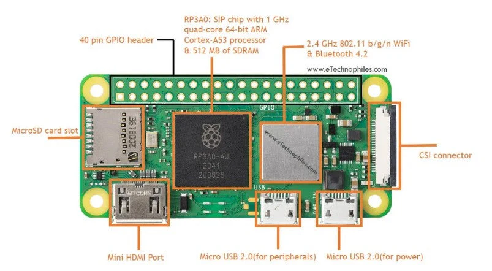
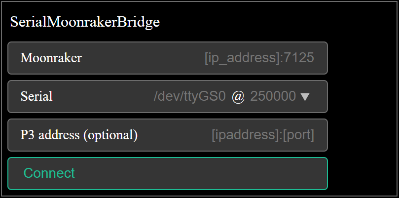
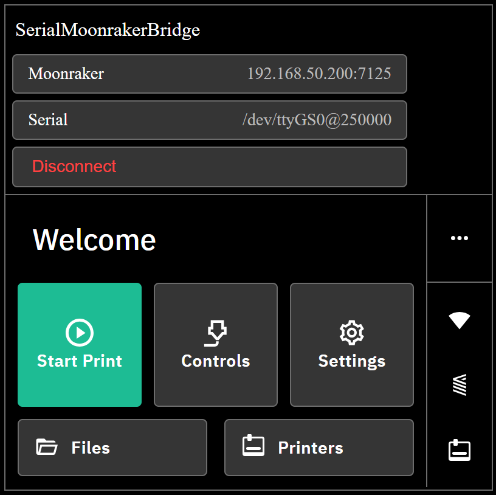

# What is this 
Python3 application that allows to bridge source of GCODE from a serial interface and feed them directly into [Moonraker](https://github.com/Arksine/moonraker) (in other words a [Klipper](https://www.klipper3d.org/) printer) via the network.

# What is it for
This tool is particularly useful to control Klipper via external softwares or devices that only control 3d printers, lasers, CNCs via a physical serial port. 

A few examples:
- [Mosaic Palette 3 (Pro)](https://www.mosaicmfg.com/products/palette-3-pro)
- [Lightburn](https://lightburnsoftware.com/)

# Current state
It is in very early stage, but it will get an install script and run as a service to make the setup as easy as possible.
As of now the script is fully functional, but it doesn't actively check or recovers from failures.
In practice it has been very reliable with my Palette 3 Pro in connected mode.

# This setup
The bridge can run on a klipper install, but to keep thing simple we will focus on creating a dedicated wifi bridge based on the Raspberry Pi Zero 2W.

# Why the Pi Zero 2W 
The Pi Zero 2W offers something called USB serial gadget. This allows it to run as a USB serial slave without the need for custom cables. This can run similarly on a Pi 3/4 with a dedicated pair of serial converters, but this approach is simpler.

The slave mode is required because the Palette 3 (Pro) requires a serial slave to be connected on its USB ports (like a Marlin based printer).

Also the Pi Zero 2W can be powered out of the Palette 3 (Pro) directly.

# Install

Note: We base this entire setup on DietPi, but it works very similarly on RaspberryPi OS Lite. Diet Pi is used because it offers the benefit of being faster to flash, faster to boot and lighter to run on ram. If you are more comfortable with Pi OS Lite, please use it.

## Diet Pi
Let's start with a fresh install of [DietPi](https://dietpi.com/#downloadinfo) for the Pi Zero 2. Download the ARMv8 version.


Please follow the install guide from DietPi https://dietpi.com/docs/install/
Before booting the first time follow the text based setup https://dietpi.com/docs/usage/#how-to-do-an-automatic-base-installation-at-first-boot-dietpi-automation

Do not boot yet !!!!

In the file **dietpi.txt** consider the following setting to disable the HDMI as it is useless in this case.
```
AUTO_SETUP_HEADLESS=1
```

## Setup the USB serial gadget
To be able to use the USB serial gadget we need to modify the file config.txt and cmdline.txt

In the file **config.txt** at the end of the file append the line:
```
dtoverlay=dwc2
```

In the file **cmdline.txt** at the end of the first line append:
```
modules-load=dwc2,g_serial
```

See https://learn.adafruit.com/turning-your-raspberry-pi-zero-into-a-usb-gadget/serial-gadget for reference.


## Install dependencies
The tool has 3 notable dependencies to install:
- [PySerial](https://pyserial.readthedocs.io/en/latest/index.html) for the serial connection.
- [Python Websockets](https://websockets.readthedocs.io/en/stable/) to keep the connection with Moonraker.
- [Flask](https://flask.palletsprojects.com/en/3.0.x/) to provide a Web based frontend.

Run:
```
sudo apt-get install python3-serial python3-websockets python3-flask git
```

Then clone this repository:
```
cd ~ && git clone https://github.com/shishu94/Klipperotchy.git
```

## Staert bridge
TODO: cleanup this section, add systemd for autostart, consider package the flask app (wheel) and use Waitress to run the server.

The app runs via flask. To start it simply run this in ssh. This will start the bridge on port 5000. Feel free to change the port if needed.

```
cd ~/Klipperotchy/SerialMoonrakerBridge
flask --app app run --host=0.0.0.0 --port=5000
```

This solution is only listed as FYI. One needs to connect the PiZ2W via ssh, not very convenient. Ideally we want the service to run directly after boot. To do so we will install a systemd service.

Run the folloying via ssh:
```
sudo cp ~/Klipperotchy/serial_moonraker_bridge.service /etc/systemd/system
sudo chmod 644 /etc/systemd/system/serial_moonraker_bridge.service
sudo systemctl daemon-reload
sudo systemctl enable serial_moonraker_bridge.service
```
Now reboot the Pi.

On restart, the bridge should be available at the local address http://[piz2w-IP]:5000

## Connect and configure the bridge
### Connect the cable
The PiZ2W will act as a slave USB, to do so, use a micro usb cable connected to the left port (for peripherals)


Then connect the USB-A to the P3. This will power the pi directly from the P3. The P3 can power the PI if onlz used for the bridge. If running anything else, please ensure that you power the PI properly.

### Configure the bridge
Once the pi started, access the bridge app at http://[replace-with-your-piz2w-IP]:5000
You should see a page like this:


- Set the moonraker address at the minimum. Mandatory
- Serial port and baudrate can stay as is. Optional
- Set the P3 address if you want to control the brigde and the P3 on the same page. Optional
- Hit connect

If everything is set properly, you should see a page like this:


Once you see the red disconnect, the bridge is ready to accept a connection from the P3.

Please proceed with the [connection guide](https://support.mosaicmfg.com/Guide/Connected+Mode+with+Palette+3/169?lang=en) from Mosaic.
